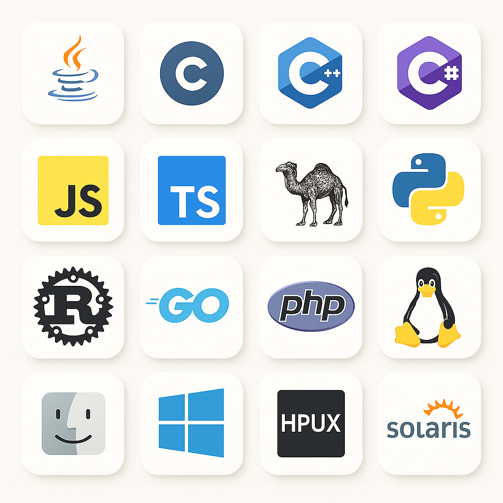

# Programming Basics
## For the Programming Merit Badge

### By Jason Mock, Software Architect

<br/>
<br/>

##### <mdi-git /> https://github.com/mockjv/programming-merit-badge

<br/>

##### <mdi-web /> https://programming-mb.jasonmock.com

---

# Who am I

<v-clicks>

### 👨‍💻 Software Architect
### 🏆 Programming Merit Badge Counselor
### 🎓 Passionate Educator
### 🚀 Technology Enthusiast




</v-clicks>

----

# What Got Me Interested In Programming?

<v-clicks>

## SUPER BUNNY!

<Youtube width="75%" height="75%" id="Rmv7ZWAMVx4" />

</v-clicks>

---

# What's Always First In Any Scouting Activity?

<v-clicks>

<AutoFitText :max="200" :min="100" modelValue="A Safety Briefing!"/>

</v-clicks>

---
layout: iframe
# the web page source
url: https://filestore.scouting.org/filestore/YPSAT/digitalsafety/story.html
---
# Digital Safety Video

---
layout: cover
---

# Common Injuries & Prevention

---

# 🖐️ Repetitive Stress Injuries (RSIs)

These happen from doing the same movement over and over—like typing or using a mouse for hours.

## Examples

- Carpal tunnel syndrome, wrist strain, tendonitis.

## Prevention

- Use a proper ergonomic setup (chair, keyboard, mouse, screen height).
- Keep wrists straight and elbows at a 90° angle.
- Take a 5-10 minute break every hour to stretch or move around.
- Do hand/wrist stretches regularly.

---

# 🖐️ Repetitive Stress Injuries (RSIs)

These happen from doing the same movement over and over—like typing or using a mouse for hours.

## First Aid:

- Stop typing and rest the area.
- Apply a cold compress if there’s swelling.
- Use a wrist brace for support.
- If pain continues, see a doctor.

---

# 👀 Eyestrain (a.k.a. Computer Vision Syndrome)

Caused by looking at screens for too long without a break.

## Prevention

- Follow the 20-20-20 Rule: Every 20 minutes, look at something 20 feet away for 20 seconds.
- Adjust screen brightness and text size.
- Use blue light filters or “night mode” in the evening.
- Make sure lighting in the room is comfortable (avoid glare).

---

# 👀 Eyestrain (a.k.a. Computer Vision Syndrome)

Caused by looking at screens for too long without a break.

## First Aid

- Look away from the screen and rest your eyes.
- Blink often or use eye drops if they feel dry.
- Close your eyes for a few minutes to relax them.

---

# 🪑 Back, Neck, and Shoulder Pain

Sitting for long periods in a bad posture can cause soreness.

## Prevention

- Sit upright with feet flat on the floor.
- Keep your monitor at eye level.
- Get up to stretch and walk around every hour.

## First Aid

- Apply heat to relax muscles or ice for swelling.
- Gentle stretching or massage may help.
- Adjust your workspace ergonomics.

---

# 🧃 Hydration and Fatigue

Sitting and staring at a screen can make you forget to drink water or rest your body and brain.

## Prevention

- Keep a water bottle nearby.
- Take short breaks to move and reset your focus.

## First Aid

- Hydrate if you feel tired or dizzy.
- Take a mental break or nap if overly fatigued.

---

# 🧠 What is Programming?

## Programming is how humans tell computers what to do—using special languages.
<br/>
<br/>

## Programming lets us make games, apps, websites, and control robots or machines.

---

# 🧮 1800s - The Babbage Engine

Charles Babbage conceived of the "Difference Engine" to perform complex calculations using an analog "automaton".

<Youtube width="75%" height="75%" id="XSkGY6LchJs" />

---
layout: image-right
image: ./images/Ada_Lovelace_(cropped).jpg
---

# 🧮 1800s - The First "Program"

Ada Lovelace, a British mathematician, wrote the first algorithm meant for a machine (Charles Babbage’s Analytical Engine).

She imagined a machine that could follow instructions—before computers even existed!

---
layout: image-left
image: https://upload.wikimedia.org/wikipedia/commons/d/d3/Glen_Beck_and_Betty_Snyder_program_the_ENIAC_in_building_328_at_the_Ballistic_Research_Laboratory.jpg
---

# 🧮 1940s – The First Computers

## World War II led to the creation of the first digital computers like the ENIAC, used to calculate artillery tables. Programming was done using switches, punch cards, and wires.

<div class="absolute bottom-20">📅 Year: 1945</div>
<div class="absolute bottom-10">📚 Source: Smithsonian Institution</div>

---

# 💻 1950s – Programming Languages Are Born

The first real programming languages were created:

- Assembly language (machine-level instructions)
- Fortran (1957) – short for “Formula Translation”, used for science & math

This is when programming started to look more like math or code rather than wires.

<div class="absolute bottom-10">📚 Source: IBM Archives</div>

---

# 💻 1950s – Programming Languages Are Born


<div class="absolute bottom-10">📚 Source: IBM Archives</div>

---
layout: image-right
image: https://upload.wikimedia.org/wikipedia/commons/d/db/Margaret_Hamilton_-_restoration.jpg
---
# 🧑‍💻 1960s – Software Engineering Becomes a Thing

## The term "software engineering" was coined in 1963 by Margaret Hamilton, a computer scientist at MIT, while working on the software for the Apollo spacecraft.

<div class="absolute bottom-10">📚 Source: MIT Lincoln Laboratory</div>

---
layout: two-cols
---


::right::

# 👩‍💻 1970s – More Powerful Languages & Operating Systems

- C programming language was invented (1972), which is still used today.
- The UNIX operating system was created using C and became the basis for Linux and MacOS.

<div class="absolute bottom-10">📚 Source: Bell Labs History</div>

---
layout: image-right
image: ./images/personal-computer.webp
---

# 🖥️ 1980s – Personal Computers Arrive

- People could now own computers like the Apple II or IBM PC.
- MS-DOS and BASIC became popular beginner languages.

This era made programming accessible to everyone—not just scientists.

<div class="absolute bottom-10">📚 Source: Computer History Museum – Personal Computers</div>

---
layout: iframe-right
url: https://info.cern.ch/hypertext/WWW/TheProject.html
---

# 🌐 1990s – The Web & Java

- The World Wide Web was invented in 1991 by Tim Berners-Lee.
- HTML, JavaScript, and Java helped make websites interactive.

<div class="absolute bottom-10">📚 Source: World Wide Web Foundation</div>

---
layout: image-left
image: ./images/iphone.png
---


# 📱 2000s – Mobile Apps & Open Source

- Open source software like Linux and Firefox exploded.
- The iPhone came out in 2007, changing how people interacted with computers.

<div class="absolute bottom-20">📚 Source: Linux Foundation</div>
<div class="absolute bottom-10">📚 Source: Apple Keynote Archive – iPhone Launch</div>

---
layout: two-cols
---

# ☁️ 2010s – Cloud Computing & Coding for All

- Platforms like GitHub (2008) made it easy to share code.
- Tools like Scratch, Code.org, and Blockly taught millions of kids to code.

<div class="absolute bottom-20">📚 Source: MIT Scratch</div>
<div class="absolute bottom-10">📚 Source: Code.org</div>

::right::


---
layout: image-left
image: ./images/ai-scout.png
---
# 🤖 2020s – AI and the Future of Code

- AI tools like ChatGPT started helping programmers write code faster.
- Low-code/no-code platforms let people build software without deep programming skills.

<div class="absolute bottom-20">📚 Source: MIT Technology Review</div>
<div class="absolute bottom-10">📚 Source: OpenAI Blog</div>

---
layout: statement
---

# Why This Matters in Scouting

### Programming teaches problem-solving, creativity, and resilience. Whether you’re building a website, making a game, or helping your patrol organize an event—code is a superpower!

---

# Intellectual Property

Four Types of Intellectual Property That Protect Computer Programs

<v-clicks>

## © Copyright

- Protects the written code (like protecting the words in a book).
- Automatically given to the creator when the code is written.

## Patents

- Protect inventions, including some software methods or algorithms.
- Must be approved by a government office.

</v-clicks>

---

# Intellectual Property

Four Types of Intellectual Property That Protect Computer Programs

<v-clicks>

## Trademarks ™

- Protect brand names, logos, and icons (e.g., the Windows or Apple logos).
- Help users know who made the software.

## Trade Secrets

- Protects private techniques or formulas (e.g., Google’s search algorithm).
- Not shared with the public; kept secret to stay competitive.

</v-clicks>

---

# 🛠️ Toolchains, Compilers and Interpreters, Oh My!

|                                              |                                                                                                                                                                                       |
| -------------------------------------------- | ------------------------------------------------------------------------------------------------------------------------------------------------------------------------------------- |
| **Compiler**                                 | An application that reads the code and *compiles* the code into either native code that the operating system of the computer understands to execute, or into an intermediary language |
| **Runtime**                                  | An application that either reads and interprets the code or intermediary language code directly                                                                                       |
| **Integrated Development Environment (IDE)** | A combination of tools operated from a graphical user interface that aides in the reading and writing of code                                                                         |

<v-click>

🚨 We won't be installing anything today!

</v-click>

---

# 🛠️ Tools We Will Be Using

## Thanks to the power of the interwebs, we can write basic applications in a web browser!
<br/>

<h2>

|                       |                                 |
| --------------------- | ------------------------------- |
| **Scratch**           | scratch.mit.edu/projects/editor |
| **JS Fiddle**         | jsfiddle.net                    |
| **Python Fiddle**     | python-fiddle.com               |
| **.NET Fiddle**       | dotnetfiddle.net                |
| **Sphero Edu Editor** | edu.sphero.com/code             |

</h2>

---

# Hello, World!

<v-clicks>

```python
# Python
print("Hello, World!")
```

```csharp
// C#
using System;
namespace MyProgram
class Program {
    void static main(string[] args) {
        Console.WriteLine("Hello, World!");
    }
}

```
```javascript
// JavaScript
console.log("Hello, World!");
```

</v-clicks>

---

# Variables

## Store data for use in your program

```python
// Python
name = "Alex"
age = 15
```

```csharp
// C#
string name = "Alex";
int age = 15;
```

```javascript
// Javascript
let name = "Alex";
const age = 15;
var val = "Test";
```

---

# Data Types

| Type       | Python  | C#       | JavaScript |
| ---------- | ------- | -------- | ---------- |
| Number     | `int`   | `int`    | `number`   |
| Decimal    | `float` | `double` | `number`   |
| True/False | `bool`  | `bool`   | `boolean`  |
| Text       | `str`   | `string` | `string`   |

---

# Conditionals

- Make decisions in code
- Use `if`, `else if`, and `else` to handle different paths

```python
# Python
if age >= 18:
    print("Adult")
elif age >= 13:
    print("Teenager")
else:
    print("Child")
```

---

# Conditionals

- Make decisions in code
- Use `if`, `else if`, and `else` to handle different paths

```csharp
// C#
if (age >= 18) {
    Console.WriteLine("Adult");
} else if (age >= 13) {
    Console.WriteLine("Teenager");
} else {
    Console.WriteLine("Child");
}
```

---

# Conditionals

- Make decisions in code
- Use `if`, `else if`, and `else` to handle different paths

```javascript
// Javascript
if (age >= 18) {
    console.log("Adult");
} else if (age >= 13) {
    console.log("Teenager");
} else {
    console.log("Child");
}
```

---

# Loops

- Repeat actions

```python
# Python
for i in range(3):
    print(i)
```

```csharp
// C#
for (int i = 0; i < 3; i++) {
    Console.WriteLine(i);
}
```

```javascript
// Javascript
for (let i = 0; i < 3; i++) {
    console.log(i);
}
```

---

# Functions

- Reusable blocks of code

```python
# Python
def greet(name):
    print("Hi, " + name)
```

```csharp
// C#
void Greet(string name) {
    Console.WriteLine("Hi, " + name);
}
```

```javascript
// Javascript
function greet(name) {
    console.log("Hi, " + name);
}
```

---

# Arrays & Lists

- Store multiple values

```python
## Python
colors = ["red", "blue", "green"]
```

```csharp
// C#
string[] colors = [ "red", "blue", "green" ];
```

```javascript
// Javascript
let colors = ["red", "blue", "green"];
```

---

# Arrays & List Operations

- Get information about the array or list

```python
## Python
colors = ["red", "blue", "green"]
print(len(colors))  # Output: 3
```

```csharp
// C#
string[] colors = { "red", "blue", "green" };
Console.WriteLine(colors.Length);  // Output: 3
```

```javascript
// Javascript
let colors = ["red", "blue", "green"];
console.log(colors.length);  // Output: 3
```

---

# For Each Loops

- Repeat actions against a list or array

```python
# Python
colors = ["red", "blue", "green"]
for color in colors:
    print(color)
```

```csharp
// C#
string[] colors = { "red", "blue", "green" };
foreach (string color in colors) {
    Console.WriteLine(color);
}
```

---

# For Each Loops

- Repeat actions against a list or array

```javascript
// Javascript
let colors = ["red", "blue", "green"];
for (let color of colors) {
    console.log(color);
}
```

---

# Functions

- Functions are reusable blocks of code that perform a specific task.
- They help make your code modular and easier to read.

```python
# Python
def greet(name):
    print("Hi, " + name)

# Call the function
greet("Alex")
```

```csharp
// C#
void Greet(string name) {
    Console.WriteLine("Hi, " + name);
}

// Call the function
Greet("Alex");
```

```javascript
// JavaScript
function greet(name) {
    console.log("Hi, " + name);
}

// Call the function
greet("Alex");
```

---

# Functions

- Functions are reusable blocks of code that perform a specific task.
- They help make your code modular and easier to read.

```csharp
// C#
void Greet(string name) {
    Console.WriteLine("Hi, " + name);
}

// Call the function
Greet("Alex");
```

---

# Functions

- Functions are reusable blocks of code that perform a specific task.
- They help make your code modular and easier to read.

```javascript
// JavaScript
function greet(name) {
    console.log("Hi, " + name);
}

// Call the function
greet("Alex");
```

---

# Comments

- Explain code to humans

```python
# Python
# This is a comment
```

```csharp
// C#
// This is a comment
```

```javascript
// Javascript
// This is a comment
```

---
layout: statement
---

# Summary

## ✅ Programming = instructing computers

## ✅ Core concepts: variables, types, conditionals, loops, functions  

## ✅ Python, C#, JavaScript share many similarities

---

# Try It Yourself!

- Write a program that asks for your name and says hello.
- Try it in all 3 languages.

```python
name = input("What's your name? ")
print("Hello, " + name)
```

---
layout: cover
---

# Example Apps

<AutoFitText :max="200" :min="100" modelValue="Let's write some code!"/>

---

# ⚙️ Number Guessing Game 🎲 [Python]

```python
import random
number = random.randint(1, 10)
guess = int(input("Guess a number 1-10: "))

if guess == number:
    print("Correct!")
elif guess < number:
    print("Too low!")
else:
    print("Too high!")
```

**Concepts Used:** input, variables, conditionals, random, functions (optional)

---

# ⚙️ Simple Calculator 🧮 [C#]

```csharp
Console.Write("First number: ");
double num1 = Convert.ToDouble(Console.ReadLine());
Console.Write("Second number: ");
double num2 = Convert.ToDouble(Console.ReadLine());
Console.Write("Add or Subtract? ");
string op = Console.ReadLine();

if (op == "Add")
    Console.WriteLine(num1 + num2);
else if (op == "Subtract")
    Console.WriteLine(num1 - num2);
else
    Console.WriteLine("Unknown operation");
```

**Concepts Used:** input, variables, conditionals, conversion, basic math

---

# ⚙️ Name Length Checker 🧪 [Javascript]

```javascript
let name = prompt("Enter your name:");
if (name.length > 10) {
  console.log("That's a long name!");
} else if (name.length > 5) {
  console.log("Nice name!");
} else {
  console.log("Short and sweet!");
}
```

**Concepts Used:** variables, input, conditionals, string properties

---

# Projects Time

## ✅ Pick 1 project for each language (Javascript, Python, C#) and let's implement them
<br/>

## &nbsp;&nbsp;&nbsp;&nbsp;&nbsp;&nbsp;&nbsp;https://bit.ly/mb-project-ideas
<br/>
<br/>

## ✅ Bonus: Implement an app to navigate a maze using Sphero

---
layout: end
---
# Next Steps

- Practice each concept
- Explore small projects
- Have fun building things!
